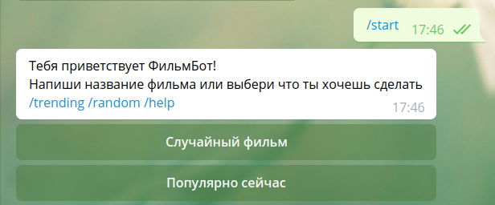
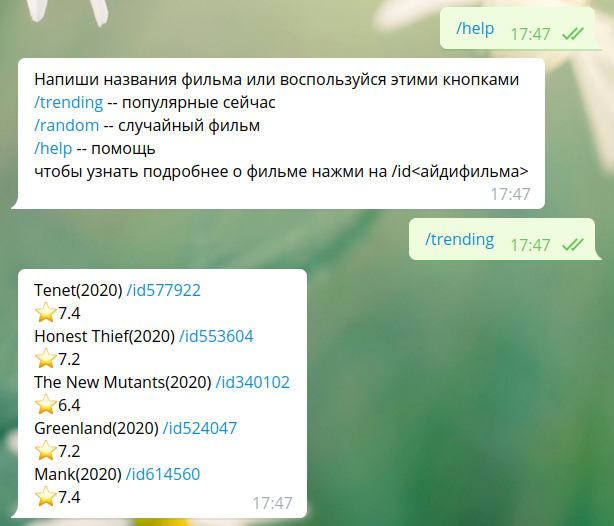
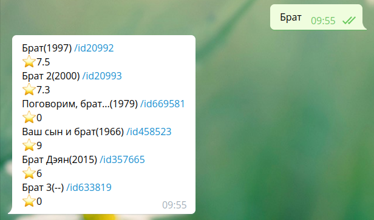
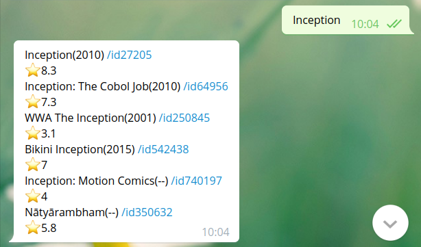

***Cinemabot***

Запуск ```bash run.sh```

Данный бот позволяет искать фильмы по названию,
а также дает возможность
выбрать случайный фильм из top 5000 tmdb и 
посмотреть популярные сейчас фильмы.


Для поиска фильмов следует отправить боту 
его название.Бот устойчив к опечаткам, 
но совсем к некоторым.

Так как информация берется из tmdb, 
то иностранные фильмы лучше ищутся по
их оригинальным названия.

При нажатии на id фильма показывается подробная 
информация о фильме и ссылки на TMDB, ivi и Netflix. 
